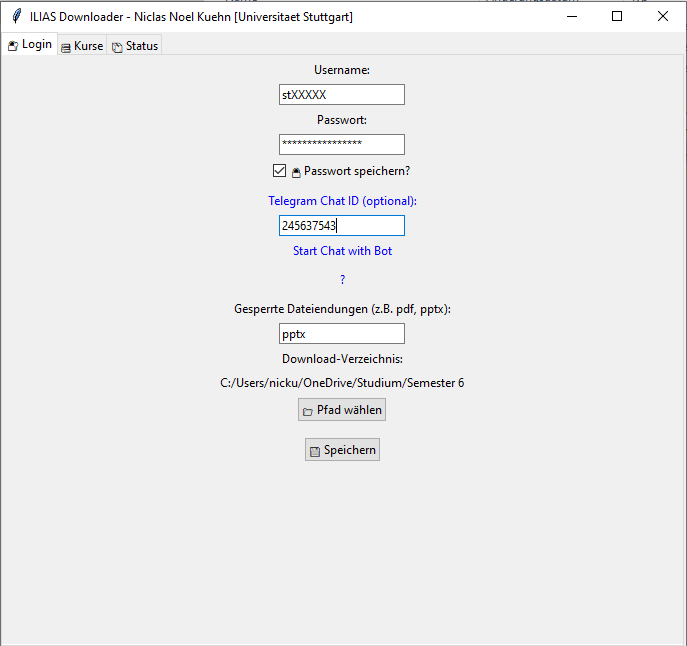
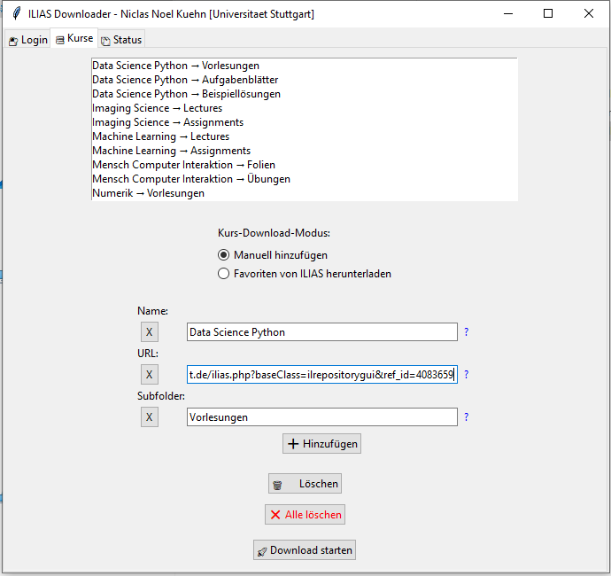
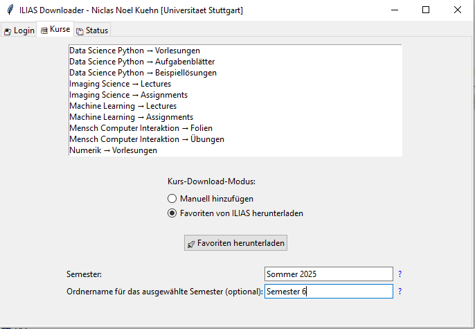
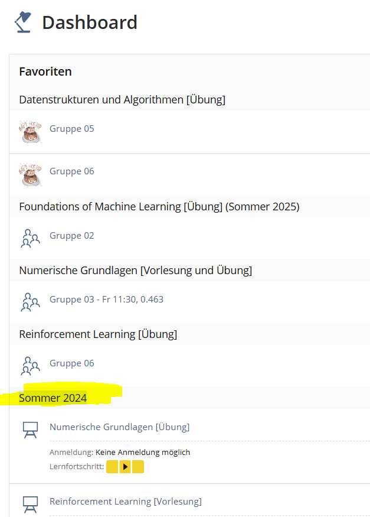
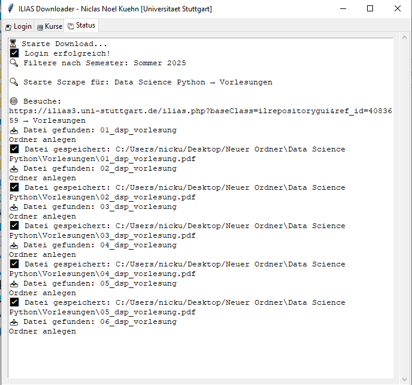

# IliasDownloader
Ilias Downloader for University of Stuttgart.

Willkommen zu deinem ILIAS-Download-Tool 

🔐 Login:
  - Trage Username und Passwort ein (Passwort-Speicherung optional).
  - Telegram-ID ist optional (für Benachrichtigungen). Um herauszufinden, welche Chat_ID ihr habt, könnt ihr den CHAT_ID Telegram bot befragen.
  - Wähle aus, welche Dateiformate ausgeschlossen werden sollen (z.B. pdf, pptx...).

📁 Kurse:
  - Gib Name, URL, Subfolder und Typ an.
  - URL: Einfach die Ilias-Seite kopieren, von der du downloaden möchtest.
  - Name: Bspw. PSE
  - Subfolder: Bspw. Vorlesungen (für VLS) und Übungen(für Abgabeblätter).
  - Das wird dann in einer Ordnerstruktur angelegt, sodass ihr Übungen unter PSE/Übungen findet etc.
    Du kannst diese Seiteninfos in der config selbst eintragen, oder in der UI. Schaue hierfür die Struktur an.
    
  
  - ODER: Favoriten Download (einfache Alternative, wenn man die Links nicht heraussuchen möchte, lädt allerdings ALLES in deinen Favoriten herunter.)
  - Du kannst hiermit auch nicht bestimmen wie die Ordner benannt werden. Es werden die Ilias-Ordnernamen verwendet.
  - Wähle den Favoriten-Download, um alle deine ILIAS-Favoriten herunterzuladen.
  - (Die Filterung nach Semester ist optional. Wenn du nur ein Semester herunterladen möchtest, gib den Namen des Semesters ein. Z.B. 'Sommer 2025' oder 'Winter 2024/25'. 
  Wenn du alle Semester herunterladen möchtest, lasse das Feld leer.)
- Wenn du einen Ordnernamen angibst, wird dieser als Ordnername für das ausgewählte Semester verwendet.
- Wenn du keinen Ordnernamen angibst, wird bspw. Sommer 2025 als Ordnername verwendet.
    

  - Getestet auf Windows.

🖥️ Download:
  - Der Download wird automatisch gestartet.
  - Der Pfad wird in config.json gespeichert.

